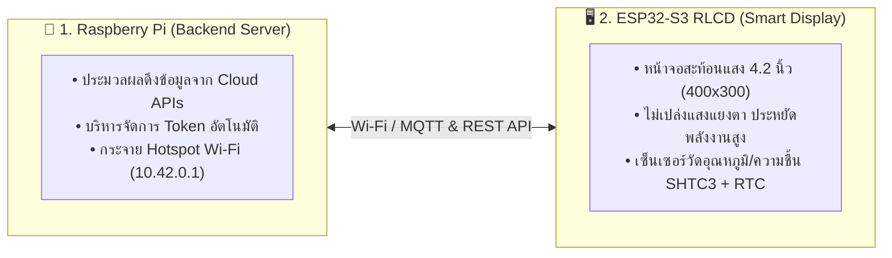
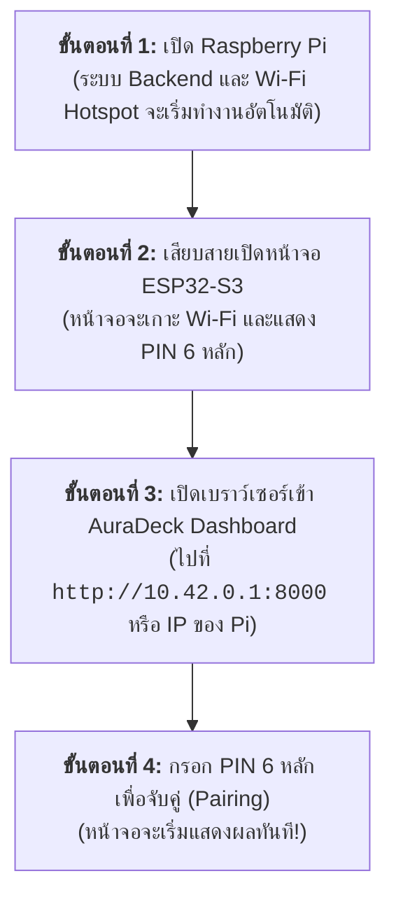
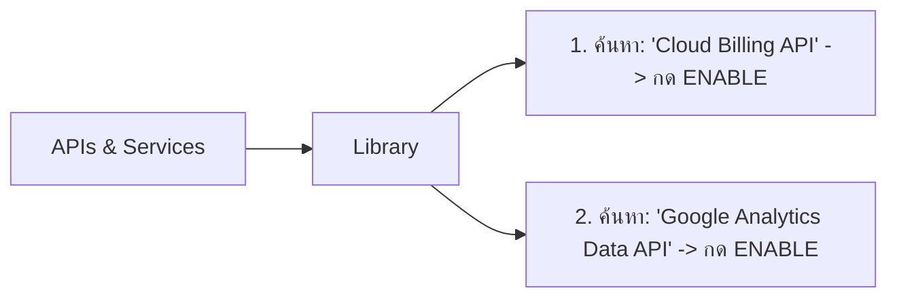

# 📖 คู่มือการใช้งานระบบ ESP32-S3 AuraDeck (User Manual)

ยินดีต้อนรับสู่คู่มือการใช้งาน **AuraDeck** — สมาร์ตแดชบอร์ดตั้งโต๊ะหน้าจอสะท้อนแสงขาวดำความคมชัดสูง (Monochrome Reflective LCD) พร้อมระบบเชื่อมต่อ Cloud และ AI ที่ประมวลผลผ่าน Raspberry Pi Server

---

## 📑 สารบัญ (Table of Contents)

1. [บทนำและภาพรวมของระบบ (System Overview)](#1-บทนำและภาพรวมของระบบ-system-overview)
2. [การเริ่มต้นเปิดเครื่องและจับคู่หน้าจอ (Quick Start & Pairing)](#2-การเริ่มต้นเปิดเครื่องและจับคู่หน้าจอ-quick-start--pairing)
3. [การเชื่อมต่อบัญชีพื้นฐาน (Google OAuth & Spotify)](#3-การเชื่อมต่อบัญชีพื้นฐาน-google-oauth--spotify)
4. [คู่มือการขอ JSON Key สำหรับ GCP & GA4 อย่างละเอียด (GCP & GA4 Setup Guide)](#4-คู่มือการขอ-json-key-สำหรับ-gcp--ga4-อย่างละเอียด-gcp--ga4-setup-guide)
   - [4.1 วิธีสร้างและดาวน์โหลด Service Account JSON Key บน Google Cloud Console (GCP)](#41-วิธีสร้างและดาวน์โหลด-service-account-json-key-บน-google-cloud-console-gcp)
   - [4.2 วิธีค้นหา GA4 Property ID และการผูกสิทธิ์ Service Account](#42-วิธีค้นหา-ga4-property-id-และการผูกสิทธิ์-service-account)
   - [4.3 วิธีนำไฟล์ JSON Key และ Property ID มาอัปโหลดใน AuraDeck Dashboard](#43-วิธีนำไฟล์-json-key-และ-property-id-มาอัปโหลดใน-auradeck-dashboard)
5. [การตั้งค่า Widget บนหน้าจอ (Screen Widgets Configuration)](#5-การตั้งค่า-widget-บนหน้าจอ-screen-widgets-configuration)
6. [การสลับหน้าจอและปุ่มกดฮาร์ดแวร์ (Hardware Navigation & Screens 0–6)](#6-การสลับหน้าจอและปุ่มกดฮาร์ดแวร์-hardware-navigation--screens-06)
7. [การแก้ไขปัญหาเบื้องต้นและคำถามที่พบบ่อย (Troubleshooting & FAQs)](#7-การแก้ไขปัญหาเบื้องต้นและคำถามที่พบบ่อย-troubleshooting--faqs)

---

## 1. บทนำและภาพรวมของระบบ (System Overview)

AuraDeck ประกอบด้วย 2 ส่วนหลักที่ทำงานประสานกันผ่านเครือข่าย Wi-Fi:



1. **Raspberry Pi (Server)**: ทำหน้าที่เชื่อมต่อกับ Cloud Services (Google, Spotify, GCP, GA4, Yahoo Finance, AI Quota) แล้วแปลงข้อมูลเป็นข้อความขนาดกะทัดรัด
2. **ESP32-S3 Display (Terminal)**: หน้าจอสำหรับวางบนโต๊ะทำงาน แสดงผลข้อมูลแบบ Real-time พร้อมปุ่มกดด้านข้างสำหรับสลับหน้าจอได้อย่างรวดเร็ว

---

## 2. การเริ่มต้นเปิดเครื่องและจับคู่หน้าจอ (Quick Start & Pairing)



### รายละเอียดการเปิดใช้งานครั้งแรก:
1. **จ่ายไฟให้ Raspberry Pi**: ระบบจะเปิด Wi-Fi Hotspot ชื่อ `AuraDeck_Hotspot` (รหัสผ่าน: `AuraDeck1234`)
2. **จ่ายไฟให้บอร์ด ESP32-S3**: หน้าจอจะทำการบูตและเชื่อมต่อ Wi-Fi จากนั้นจะแสดงผล **PIN 6 หลัก (เช่น `839201`)**
3. **เปิดหน้าควบคุม AuraDeck Control Center**: 
   - นำมือถือหรือคอมพิวเตอร์เชื่อมต่อกับ `AuraDeck_Hotspot`
   - เปิดเบราว์เซอร์แล้วไปที่ [http://10.42.0.1:8000](http://10.42.0.1:8000) *(หรือผ่าน Tailscale เช่น `http://kea-pi-server:8000`)*
4. **ลงชื่อเข้าใช้ (Sign In)**:
   - กดปุ่ม **Sign In with Google** เพื่อเข้าสู่ Dashboard ประจำตัวของคุณ
5. **ทำการ Pairing**:
   - ในหน้า Dashboard เลือกเมนู **Device Pairing**
   - กรอก PIN 6 หลักที่ปรากฏบนหน้าจอ ESP32-S3 แล้วกดยืนยัน
   - หน้าจอจะสลับเข้าสู่หน้าหลัก (Home Screen) โดยอัตโนมัติ

---

## 3. การเชื่อมต่อบัญชีพื้นฐาน (Google OAuth & Spotify)

ในหน้า AuraDeck Dashboard เลื่อนลงมาที่หมวด **"🔌 Connected Cloud Accounts & Analytics"**:

### 📅 การเชื่อมต่อ Google Workspace (Calendar & Tasks)
1. ในการ์ด **Google Workspace** กดปุ่ม **Authorize Google**
2. ระบบจะเปิดหน้าต่างของ Google เพื่อให้คุณเลือกลงชื่อเข้าใช้และกดยอมรับสิทธิ์การอ่านข้อมูล:
   - ปฏิทินนัดหมาย (Google Calendar)
   - รายการสิ่งที่ต้องทำ (Google Tasks)
3. เมื่อเสร็จสิ้น สถานะจะเปลี่ยนเป็น **Connected (สีเขียว)** ข้อมูลตารางงานและ To-Do list ภาษาไทยจะถูกส่งขึ้นหน้าจออัตโนมัติ

### 🎵 การเชื่อมต่อ Spotify Premium
1. ในการ์ด **Spotify Premium** กดปุ่ม **Authorize Spotify**
2. เข้าสู่ระบบบัญชี Spotify และกด **Agree (ยอมรับ)**
3. เมื่อเชื่อมต่อแล้ว หน้าจอจะแสดงชื่อเพลง ศิลปิน แถบเวลาความยาวเพลงแบบ Real-time และสามารถกด Pause/Play ได้จากหน้าเว็บ

---

## 4. คู่มือการขอ JSON Key สำหรับ GCP & GA4 อย่างละเอียด (GCP & GA4 Setup Guide)

> [!IMPORTANT]
> ระบบ AuraDeck ใช้วิธีการเชื่อมต่อผ่าน **Service Account JSON Key** ซึ่งมีความปลอดภัยสูง ทำงานได้ตลอด 24 ชั่วโมงโดยไม่มีปัญหาโทเค็นหลุด และสามารถผูกได้หลาย Project / หลาย GA4 Property ข้ามบัญชี Google กันได้

---

### 4.1 วิธีสร้างและดาวน์โหลด Service Account JSON Key บน Google Cloud Console (GCP)

ทำตามขั้นตอนทีละ Step ดังนี้:

#### ขั้นที่ 1: เข้าสู่ Google Cloud Console
1. ไปที่เว็บไซต์ [https://console.cloud.google.com/](https://console.cloud.google.com/)
2. ล็อกอินด้วยบัญชี Google ที่เป็นเจ้าของหรือผู้ดูแลโปรเจกต์ GCP

#### ขั้นที่ 2: เลือกหรือสร้าง Project
- ที่แถบเมนูด้านบน คลิกที่กล่องเลือกโปรเจกต์ (Select a Project)
- เลือกโปรเจกต์ที่ต้องการใช้งาน หรือกด **NEW PROJECT** เพื่อสร้างโปรเจกต์ใหม่

---

#### ขั้นที่ 3: เปิดใช้งาน APIs ที่จำเป็น (Enable APIs)
1. ไปที่เมนูด้านซ้ายบน (Navigation Menu ☰) > เลือก **APIs & Services** > **Library**
2. ค้นหาและกด **ENABLE** สำหรับ 2 บริการต่อไปนี้:
   * **Cloud Billing API** (สำหรับการดูค่าใช้จ่ายคลาวด์)
   * **Google Analytics Data API** (สำหรับการดึงสถิติผู้เข้าชม GA4)



---

#### ขั้นที่ 4: สร้าง Service Account
1. ไปที่เมนู **IAM & Admin** (IAM และผู้ดูแลระบบ) > เลือก **Service Accounts** (บัญชีบริการ)
2. คลิกปุ่ม **+ CREATE SERVICE ACCOUNT** ที่แถบด้านบน
3. กำหนดข้อมูลบัญชีบริการ:
   * **Service account name**: ตั้งชื่อ เช่น `auradeck-dashboard`
   * **Service account ID**: ระบบจะสร้างอีเมลให้อัตโนมัติ เช่น `auradeck-dashboard@your-project-id.iam.gserviceaccount.com`
   * **Description**: ใส่คำอธิบาย เช่น `AuraDeck Monitor Service Account`
4. คลิก **CREATE AND CONTINUE**
5. **กำหนดสิทธิ์ (Grant Roles)**:
   * ในช่อง Role เลือก **Project** > **Viewer** (ผู้ดู)
   * *(สำหรับ Billing: หากต้องการดูยอดเงิน สามารถเพิ่ม Role `Billing Account Viewer` หรือเพิ่มสิทธิ์ในเมนู Billing Account)*
6. คลิก **DONE**

---

#### ขั้นที่ 5: สร้างและดาวน์โหลดไฟล์ JSON Key
1. ในหน้ารายการ Service Accounts ให้คลิกที่ **อีเมลของ Service Account** ที่เพิ่งสร้าง (`auradeck-dashboard@...`)
2. คลิกที่แท็บ **Keys** (คีย์) ด้านบน
3. คลิกปุ่ม **ADD KEY** > เลือก **Create new key**
4. เลือกรูปแบบคีย์เป็น **JSON**
5. คลิก **CREATE**
6. เว็บบราวเซอร์จะทำการดาวน์โหลดไฟล์นามสกุล `.json` (เช่น `your-project-id-xxxxxxxxxxxx.json`) มายังคอมพิวเตอร์ของคุณทันที!

> [!TIP]
> **หากพบ Error: "Service account key creation is disabled (iam.disableServiceAccountKeyCreation)":**
> เกิดจากนโยบายความปลอดภัยเริ่มต้น (Secure by Default) ของ Google Cloud บล็อกการสร้างคีย์ไว้ สามารถปลดล็อกได้ดังนี้:
> 1. ไปที่เมนู **IAM & Admin** > **Organization Policies** (นโยบายขององค์กร)
> 2. ค้นหา `disableServiceAccountKeyCreation` แล้วคลิกที่นโยบาย **Disable service account key creation**
> 3. คลิกปุ่ม **MANAGE POLICY** (หรือ **EDIT**)
> 4. เลือก **Override parent's policy** > ตั้งค่า **Enforcement** เป็น **Off** (ปิดการบังคับใช้) แล้วกด **Set Policy**
> 5. รอประมาณ 1 นาที แล้วกลับมากดสร้าง JSON Key ใหม่อีกครั้ง

> [!CAUTION]
> **ความปลอดภัย:** ไฟล์ `.json` นี้เปรียบเสมือนรหัสผ่านสำหรับเข้าถึงข้อมูล โปรดเก็บไฟล์นี้ไว้ในที่ปลอดภัยและ**ห้าม**อัปโหลดขึ้น GitHub หรือส่งให้ผู้อื่น

---

### 4.2 วิธีค้นหา GA4 Property ID และการผูกสิทธิ์ Service Account

หากต้องการให้ AuraDeck ดึงยอดผู้เข้าชมเว็บไซต์แบบ Real-time จาก Google Analytics 4 (GA4) ให้ตั้งค่าเพิ่มเติมดังนี้:

#### ขั้นที่ 1: ค้นหา GA4 Property ID
1. ไปที่ [https://analytics.google.com/](https://analytics.google.com/)
2. คลิกไอคอนรูปฟันเฟือง **Admin** (ผู้ดูแลระบบ) ที่มุมล่างซ้าย
3. ในคอลัมน์ **Property** (พร็อพเพอร์ตี้) ให้คลิกที่ **Property Details** (รายละเอียดพร็อพเพอร์ตี้)
4. มองที่มุมบนขวา จะพบ **PROPERTY ID** เป็นตัวเลข 9–10 หลัก (เช่น `453120000`)
5. ให้ **Copy (คัดลอก)** ตัวเลขนี้เก็บไว้

```
┌──────────────────────────────────────────────────────────┐
│  Property Details                                        │
│  Property Name: My Awesome Website                       │
│                                  PROPERTY ID: 453120000  │ <--- คัดลอกเลขนี้
└──────────────────────────────────────────────────────────┘
```

---

#### ขั้นที่ 2: เพิ่ม Service Account Email เข้าไปในสิทธิ์ของ GA4
1. ในหน้า **Admin** ของ Google Analytics ภายใต้คอลัมน์ Property ให้คลิก **Property Access Management** (การจัดการสิทธิ์เข้าถึงพร็อพเพอร์ตี้)
2. คลิกปุ่มเครื่องหมายบวก **+** ที่มุมบนขวา > เลือก **Add users** (เพิ่มผู้ใช้)
3. ในช่อง **Email addresses**: วางอีเมลของ Service Account ที่เราได้มาจากข้อ 4.1 (เช่น `auradeck-dashboard@your-project-id.iam.gserviceaccount.com`)
4. ในส่วน **Direct roles and data restrictions**: เลือกสิทธิ์เป็น **Viewer** (ผู้ดู)
5. คลิกปุ่ม **Add** ที่มุมบนขวา

---

### 4.3 วิธีนำไฟล์ JSON Key และ Property ID มาอัปโหลดใน AuraDeck Dashboard

เมื่อได้ไฟล์ `.json` และ `Property ID` มาแล้ว ให้นำมาใส่ใน AuraDeck Dashboard:

```mermaid
flowchart TD
    subgraph GA4Upload["📊 ตั้งค่า Google Analytics 4"]
        G1["1. กรอก GA4 Property ID (เช่น 453120000)"]
        G2["2. กรอก Display Name (เช่น เว็บหลัก, บล็อก)"]
        G3["3. ลากไฟล์ .json มาวางที่กล่อง Upload"]
        G1 --> G2 --> G3
    end

    subgraph GCPUpload["📁 ตั้งค่า GCP Project Billing"]
        C1["1. กรอก Display Name (เช่น Prod Server)"]
        C2["2. เลือกสกุลเงิน Currency (฿ THB หรือ $ USD)"]
        C3["3. ลากไฟล์ .json มาวางที่กล่อง Upload"]
        C1 --> C2 --> C3
    end
```

1. เปิดหน้าเว็บ AuraDeck Dashboard ([http://10.42.0.1:8000](http://10.42.0.1:8000))
2. เลื่อนลงมาที่หมวด **"🔌 Connected Cloud Accounts & Analytics"**

#### สำหรับ Google Analytics 4 (GA4):
- ในการ์ด **Google Analytics 4 (GA4)**:
  - ช่อง **GA4 Property ID \***: วางตัวเลข Property ID ที่คัดลอกมา
  - ช่อง **Display Name**: ใส่ชื่อเรียก เช่น `Main Website`
  - คลิกหรือลากไฟล์ Service Account `.json` มาวางในกล่อง **Upload Service Account JSON Key**
  - ระบบจะบันทึกและแสดงการ์ด Property พร้อมสถานะการเชื่อมต่อทันที!

#### สำหรับ GCP Multi-Project Billing:
- ในการ์ด **📁 GCP Multi-Project Manager**:
  - ช่อง **Display Name**: ใส่ชื่อโปรเจกต์ เช่น `Company Backend`
  - ช่อง **Currency**: เลือกสกุลเงินที่ต้องการแสดงผล (เช่น `฿ THB` หรือ `$ USD`)
  - คลิกหรือลากไฟล์ Service Account `.json` มาวางในกล่อง **Upload Service Account JSON Key**
  - ระบบจะบันทึกและพร้อมดึงยอดค่าใช้จ่ายขึ้นหน้าจอทันที!

> [!TIP]
> **ระบบ Multi-Property / Multi-Project:** คุณสามารถทำขั้นตอนนี้ซ้ำเพื่อเพิ่มได้หลายเว็บไซต์และหลายโปรเจกต์ โดยหน้าจอ ESP32-S3 จะสลับแสดงผลข้อมูลของแต่ละโปรเจกต์ให้อัตโนมัติ

---

## 5. การตั้งค่า Widget บนหน้าจอ (Screen Widgets Configuration)

ในหน้า AuraDeck Dashboard คุณสามารถปรับแต่งข้อมูล Widget เพิ่มเติมได้ตามต้องการ:

### 📈 รายการหุ้นและคริปโต (Market Watchlist)
- ในหมวด **Market Watchlist**:
  - เพิ่มสัญลักษณ์หุ้นไทย (ต่อท้ายด้วย `.BK` เช่น `CPALL.BK`, `PTT.BK`, `BDMS.BK`)
  - เพิ่มดัชนีและคริปโตสากล (เช่น `^SET.BK`, `BTC-USD`, `ETH-USD`, `GC=F` สำหรับราคาทองคำ)
  - ระบบจะคำนวณราคาล่าสุดและ % การเปลี่ยนแปลงขึ้นบน Screen 2

### 🤖 Google Antigravity & AI Resource Monitor
- ตรวจสอบยอดเครดิต AI และ Rate limit การใช้งาน Gemini / Claude / GPT
- ระบบจะอัปเดตสถานะเครดิตคงเหลือและเปอร์เซ็นต์โควตารายสัปดาห์ขึ้นบน Screen 1 โดยอัตโนมัติ

---

## 6. การสลับหน้าจอและปุ่มกดฮาร์ดแวร์ (Hardware Navigation & Screens 0–6)

ที่ตัวเครื่องหน้าจอ ESP32-S3 จะมีปุ่มกดฮาร์ดแวร์ด้านข้าง (**KEY Button - GPIO18**):

```
┌──────────────────────────────────────────────────────────┐
│                                                          │
│                 AuraDeck Smart Display                   │
│                       (400 x 300)                        │
│                                                  [KEY]   │ <-- กดปุ่มนี้เพื่อสลับหน้า
│                                                 Button   │
└──────────────────────────────────────────────────────────┘
```

กดปุ่ม **1 ครั้ง** เพื่อเปลี่ยนหน้าจอเรียงตามลำดับ (0 ถึง 6):

| หมายเลขหน้า | ชื่อหน้าจอ (Screen) | ข้อมูลที่แสดงผล |
| :---: | :--- | :--- |
| **Page 0** | **Home Ambient Clock** | นาฬิกาบอกเวลาขนาดใหญ่, วันที่, วันในสัปดาห์, อุณหภูมิ (°C) และความชื้นสัมพัทธ์ (%RH) จากเซ็นเซอร์ SHTC3 ในตัว |
| **Page 1** | **Antigravity AI Tracker** | ยอดเครดิต AI คงเหลือ, โควตาการใช้งานรายสัปดาห์, สถานะแพ็กเกจ AI Subscription |
| **Page 2** | **Market & Stocks Watchlist** | ราคาหุ้นไทย, ดัชนี SET, ราคาทองคำ Gold Spot, บิตคอยน์ BTC พร้อมลูกศรขึ้น/ลงและเปอร์เซ็นต์กำไร-ขาดทุน |
| **Page 3** | **Google Tasks Checklist** | รายการสิ่งที่ต้องทำ (To-Do Items) ล่าสุดจาก Google Tasks พร้อมระบบจัดสระภาษาไทยสวยงาม |
| **Page 4** | **Google Calendar Agendas** | รายการนัดหมายและประชุมที่กำลังจะมาถึงในวันนี้ เรียงตามลำดับเวลาอย่างชัดเจน |
| **Page 5** | **Spotify Now Playing** | ชื่อเพลง, ศิลปิน, แทร็กอัลบั้ม, และแถบแสดงความคืบหน้าเพลงที่กำลังเล่นอยู่ |
| **Page 6** | **Cloud Analytics & Billing** | ยอดผู้เข้าชมเว็บแบบ Real-time (GA4 Active Users) และยอดสรุปค่าใช้จ่ายคลาวด์ประจำเดือน (GCP Month-to-Date Cost) |

---

## 7. การแก้ไขปัญหาเบื้องต้นและคำถามที่พบบ่อย (Troubleshooting & FAQs)

### ❓ 1. อัปโหลดไฟล์ Service Account JSON แล้ว แต่หน้าจอขึ้น "DEMO_MODE" หรือ "No Data"
* **สาเหตุที่ 1:** ยังไม่ได้เปิดใช้งาน (Enable) API ใน Google Cloud Console
  * *วิธีแก้:* ไปที่ GCP Console > **APIs & Services** > **Library** แล้วตรวจสอบว่าได้กด **Enable** ทั้ง `Cloud Billing API` และ `Google Analytics Data API` เรียบร้อยแล้ว
* **สาเหตุที่ 2:** สำหรับ GA4 ยังไม่ได้เพิ่ม Service Account Email เข้าไปใน Property Access Management
  * *วิธีแก้:* ตรวจสอบขั้นตอนที่ 4.2 ข้อ 2 โดยนำอีเมล `xxx@xxx.iam.gserviceaccount.com` ไปเพิ่มเป็น **Viewer** ในหน้า Google Analytics Admin
* **สาเหตุที่ 3:** ใส่ตัวเลข GA4 Property ID ไม่ถูกต้อง
  * *วิธีแก้:* ตรวจสอบว่าเป็นตัวเลข Property ID 9–10 หลัก ไม่ใช่ Tracking ID (เช่นไม่ใช่ `G-XXXXXXX` หรือ `UA-XXXXXXX`)

---

### ❓ 2. หน้าจอ ESP32-S3 แสดง "Offline / Reconnecting"
* **สาเหตุ:** หน้าจอหลุดจากการเชื่อมต่อ Wi-Fi ของ Raspberry Pi
* **วิธีแก้:**
  1. ตรวจสอบว่า Raspberry Pi เปิดอยู่และ Hotspot `AuraDeck_Hotspot` ทำงานปกติ
  2. หากระยะห่างไกลเกินไป ให้ย้ายหน้าจอเข้ามาใกล้ Raspberry Pi
  3. ระบบมีฟังก์ชันเชื่อมต่อใหม่อัตโนมัติในเบื้องหลัง หน้าจอจะกลับมาแสดงผลทันทีเมื่อพบสัญญาณ

---

### ❓ 3. เวลาบนหน้าจอไม่ตรง หรือเซ็นเซอร์อุณหภูมิแสดงค่าขีด (-)
* **การทำงาน:** หน้าจอ AuraDeck มีชิป **PCF85063 Real-Time Clock** พร้อมแบตเตอรี่สำรองในตัว และมีระบบกู้คืนสัญญาณ I2C Bus อัตโนมัติ (Self-Healing Bus Recovery)
* **วิธีแก้:** เมื่อตัวเครื่องเชื่อมต่ออินเทอร์เน็ตผ่าน Pi ระบบจะทำการ Sync เวลามาตรฐาน NTP และตั้งค่าลงในชิป RTC อัตโนมัติ

---

### ❓ 4. หากต้องการรีสตาร์ตระบบทั้งหมดทำอย่างไร?
* **บน Raspberry Pi:**
  ```bash
  cd ~/ESP32-AuraDeck
  docker compose restart
  ```
* **บนหน้าจอ ESP32-S3:** กดปุ่ม **RST (Reset)** บนตัวบอร์ด หรือถอดสาย USB แล้วเสียบใหม่ ตัวเครื่องจะเริ่มทำงานใหม่ภายใน 2-3 วินาที

---

### ❓ 5. กดสร้าง Service Account Key แล้วขึ้น "Service account key creation is disabled"
* **สาเหตุ:** Google Cloud เปิดการบังคับใช้นโยบายความปลอดภัย **Organization Policy** (`iam.disableServiceAccountKeyCreation`) โดยอัตโนมัติสำหรับโปรเจกต์ใหม่ (Secure by Default) หรือเป็นบัญชีองค์กร
* **วิธีแก้:**
  1. ไปที่เมนู **IAM & Admin** > **Organization Policies** (นโยบายขององค์กร)
  2. ค้นหาคำว่า `disableServiceAccountKeyCreation`
  3. คลิกที่นโยบาย **Disable service account key creation**
  4. คลิกปุ่ม **MANAGE POLICY** หรือ **EDIT** ด้านบน
  5. เลือก **Override parent's policy** > ตั้งค่า **Enforcement** เป็น **Off** (ปิดการบังคับใช้) แล้วกด **Set Policy**
  6. รอประมาณ 1 นาที แล้วกลับไปหน้า Service Accounts เพื่อกดสร้าง JSON Key ใหม่อีกครั้ง

---

*สร้างและดูแลรักษาโดยทีมงาน AuraDeck — มุ่งเน้นประสบการณ์ใช้งานที่ราบรื่นและสวยงาม* 🌟
