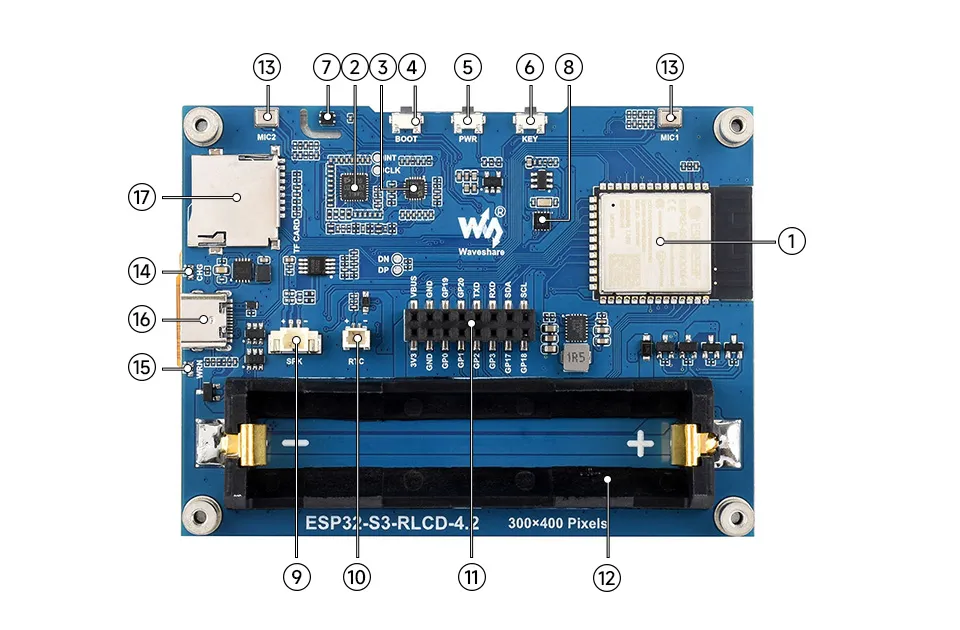

# ESP32-S3-RLCD-4.2
Srouce: [https://docs.waveshare.com/en/esp32s3rlcd42/](https://docs.waveshare.com/en/esp32s3rlcd42/)

This product is a fully reflective screen AIoT development board based on the ESP32-S3, supporting dual-mode communication with Wi-Fi and BLE. It features a 4.2inch fully reflective display (RLCD), low power consumption, display performance close to that of an e-Paper screen, and faster refresh response. It includes onboard audio codec circuitry, dual microphones, speaker, SHTC3 high-precision temperature and humidity sensor, TF card slot, RTC interface, and battery charge and discharge management circuit, etc. It also reserves USB, UART, I2C, and multiple GPIO interfaces for convenient expansion. It supports AI voice, temperature and humidity monitoring, and IoT control, and is suitable for DIY desktop smart ornaments, electronic calendars, AI agents, etc., and can also be used for product prototype development.

## Features
- Powered by a high-performance Xtensa 32-bit LX7 dual-core processor, with a main frequency of up to 240MHz
- Supports 2.4GHz Wi-Fi and Bluetooth 5 (LE), with built-in antenna
- Built-in 512KB SRAM, 384KB ROM, stacked with 16MB Flash and 8MB PSRAM integrated
- Equipped with a 4.2inch fully reflective screen with a resolution of 300 × 400, featuring characteristics of reflection imaging and no backlight required
- Equipped with a dual-microphone array for audio algorithms such as noise reduction and echo cancellation, suitable for accurate speech recognition and near-field/far-field wake-up applications
- Onboard PCF85063 RTC real-time clock and SHTC3 temperature and humidity sensor enable precise RTC time management and environmental monitoring
- Onboard 18650 lithium battery holder and RTC backup battery holder (requires a rechargeable RTC battery), supporting dual modes of main power supply and independent RTC power backup
- Built-in TF card slot, supports external storage of images or files
- Onboard KEY and BOOT two side buttons with customizable functions, allowing for custom function development
- Reserved 2 × 8 female header interface (2.54mm pitch) for convenient external expansion

## Onboard Resources

1. ESP32-S3-WROOM-1-N16R8 Wi-Fi and Bluetooth SoC, up to 240MHz operating frequency, stacked with 16MB Flash and 8MB PSRAM
2. ES7210 ADC chip implements echo cancellation circuit
3. ES8311 Low-power audio codec chip
4. BOOT Button Press and hold the BOOT button to power on again to enter download mode
5. PWR Button Long press to power off, single click to power on
6. KEY Button Customizable function button
7. SHTC3 Temperature and Humidity Sensor Provides ambient temperature and humidity measurement, enabling 8. environmental monitoring function
8. PCF85063 RTC clock chip, supporting time-keeping functionality
9. MX1.25 2PIN Speaker Header Audio signal output, for connecting external speaker
10. RTC Independent Power Interface Supports only PH1.0 rechargeable RTC battery
11. 2 × 8PIN 2.54mm Pitch Female Header
12. 18650 Battery Holder
13. Dual Microphone Array Design Dual microphone array with ES7210 for echo cancellation
14. CHG Charging Indicator Light The light turns off when the battery is fully charged
15. WRN Warning Indicator Light The light stays on if the battery is reverse-connected
16. Type-C Interface Used for program flashing and log printing
17. TF Card Slot Supports FAT32-formatted TF card for data expansion

## Interface Introduction
| ESP32-S3 | LCD | USB | RTC | SD | ES8311 | QMI8658C | SYS | OUT |
| :--- | :--- | :--- | :--- | :--- | :--- | :--- | :--- | :--- |
| **GPIO1** | | | | | | | | |
| **GPIO2** | | | | | | | | |
| **GPIO3** | | | | | | | | |
| **GPIO4** | | | | | | | BAT ADC | |
| **GPIO5** | LCD RS | | | | | | | |
| **GPIO6** | LCD TE | | | | | | | |
| **GPIO7** | TP INT | | | | | | | |
| **GPIO8** | | | | | I2S DSDIN | | | |
| **GPIO9** | | | | | I2S SCLK | | | |
| **GPIO10** | | | | | I2S ASDOUT | | | |
| **GPIO11** | LCD SCL | | | | | | | |
| **GPIO12** | LCD SDA | | | | | | | |
| **GPIO13** | TP SDA | | RTC SDA | | | ESP32 SDA | | ESP32 SDA |
| **GPIO14** | TP SCL | | RTC SCL | | | ESP32 SCL | | ESP32 SCL |
| **GPIO15** | | | RTC INT | | | | | |
| **GPIO16** | | | | | I2S MCLK | | | |
| **GPIO17** | | | | | | | | GPIO17 |
| **GPIO18** | | | | | | | KEY | |
| **GPIO19** | | | | | | | USB' N | |
| **GPIO20** | | | | | | | USB' P | |
| **GPIO21** | | | | MOSI | | | | |
| **GPIO38** | | | | SCK | | | | |
| **GPIO39** | | | | MISO | | | | |
| **GPIO40** | LCD CS | | | | | | | |
| **GPIO41** | LCD RESET | | | | | | | |
| **GPIO42** | TP RESET | | | | | | | |
| **GPIO43** | | | | | | | | U0TXD |
| **GPIO44** | | | | | | | | U0RXD |
| **GPIO45** | | | | | I2S LRCK | | | |
| **GPIO46** | | | | | PA CTRL | | | |

## Development Methods
The ESP32-S3-RLCD-4.2 supports two development frameworks: Arduino IDE and ESP-IDF, offering flexibility for developers. You can choose the appropriate development tool based on project requirements and personal preferences.

Both development methods have their own advantages. Developers can choose based on their needs and skill levels. Arduino is simple to learn and quick to start, suitable for beginners and non-professionals. ESP-IDF provides more advanced development tools and stronger control capabilities, suitable for developers with professional backgrounds or higher performance requirements, and is more appropriate for complex project development.

Arduino IDE is a convenient, flexible, and easy-to-use open-source electronics prototyping platform. It requires minimal foundational knowledge, allowing for rapid development after a short learning period. Arduino has a huge global user community, providing a vast amount of open-source code, project examples, and tutorials, as well as a rich library ecosystem that encapsulates complex functions, enabling developers to implement various features rapidly. You can refer to the Working with Arduino to complete the initial setup, and the tutorial also provides related example programs for reference.

ESP-IDF, short for Espressif IoT Development Framework, is a professional development framework launched by Espressif Systems for its ESP series of chips. It is based on C language development and includes compilers, debuggers, flashing tools, etc. It supports development via command line or integrated development environments (such as Visual Studio Code with the Espressif IDF plugin), which provides features like code navigation, project management, and debugging. We recommend using VS Code for development. For the specific configuration process, please refer to the Working with ESP-IDF. The tutorial also provides relevant example programs for reference.